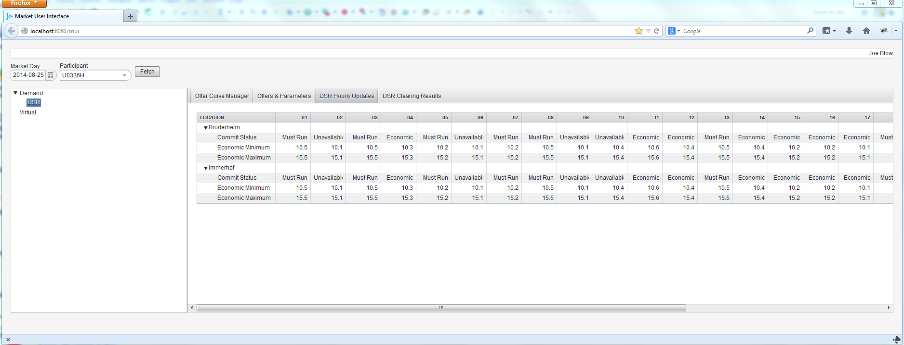

MVP Sample
==========

This is just a sample application that employs all the "good stuff" from Vaadin Spring Boot libraries, with a
focus on MVP architecture.

## Quick Start ##

Clone this repository `git clone https://github.com/fastnsilver/vaadin4spring.git`

Build the library and sample modules with Maven using 

    `mvn clean install`

To run the `mvp-sample` application, change directories into `mvp-sample`, and execute:

    java -jar mvp-sample-x.x.x-SNAPSHOT.war
    
where x.x.x is the current `SNAPSHOT` version

Launch your browser and visit

    http://localhost:8080/market/ui

You will have to authenticate.  There are two accounts:

    admin/admin
    user/user
        
Primary navigation is driven by clicking on nodes in left-hand tree-pane.

Click on `DSR`.

Note that the right-hand area will display a list of tabs; this is the secondary navigation.

Click on `DSR Hourly Updates`.

Note that the header (an area above the left and right-hand panes) gets populated with some controls.

The controls drive what will ultimately be displayed in the right-hand pane. (Typically a grid or form).
Also, note the controls are chained with `ValueChangeListener`s. (E.g., selecting a `Market Day` will limit the list of available `Participant`s).

See [MockParticipantDAO](https://github.com/fastnsilver/vaadin4spring/blob/master/samples/mvp-sample/src/main/java/org/vaadin/spring/samples/mvp/ui/mock/MockParticipantDAO.java) for which participants are "effective" on a particular date.

## Screenshot ##

What you should see once you select a day and participant and click the Fetch button...

## Security Notes ##

A little documented feature of the Vaadin + Spring Boot integration is how you configure delivery of static content.  In order for security to work you must declare a custom widgetset and reference it as a servlet initialization parameter. 

See this [pull request](https://github.com/peholmst/vaadin4spring/pull/84), [application.yml](https://github.com/peholmst/vaadin4spring/blob/master/samples/mvp-sample/src/main/resources/application.yml) and [StaticContentVaadinServletConfiguration](https://github.com/peholmst/vaadin4spring/blob/master/spring-boot-vaadin/src/main/java/org/vaadin/spring/boot/config/StaticContentVaadinServletConfiguration.java) for details.
